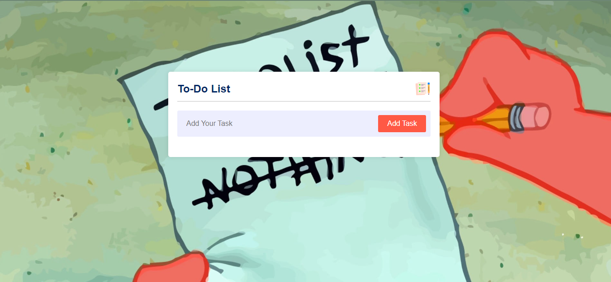
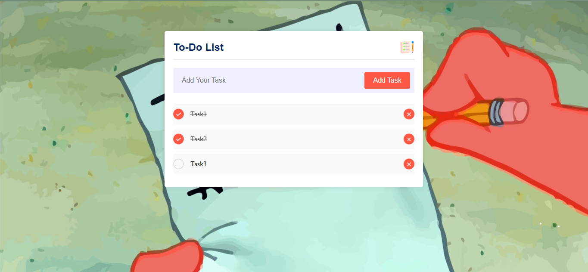
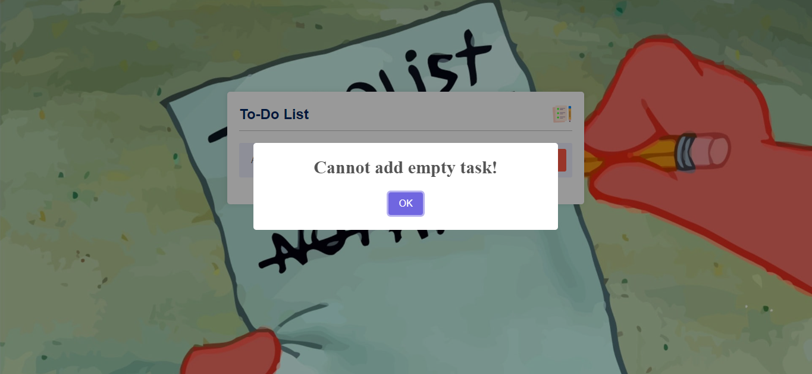

# ToDo List App

This is a simple ToDo List application for managing tasks. It uses HTML, CSS, JavaScript, and SweetAlert 2.

## Features

- Add and delete tasks
- Keyboard accessibility for adding tasks
- User-friendly interface
- Responsive design for all devices
- Real-time updates with SweetAlert 2 notifications

## Technologies Used

- HTML
- CSS
- JavaScript
- SweetAlert 2

## Preview

## Live Demo

Check out the live demo [here](https://your-demo-link.com).
